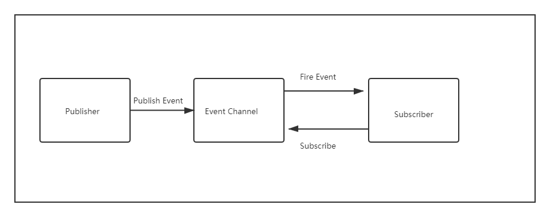
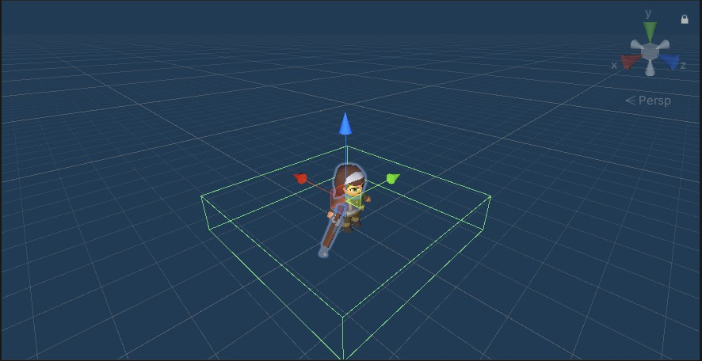

### report

作业使用方法：

在unity中新建一个项目，将此仓库中的Assets替换项目中的Assets，之后将Assets中的Sence中的mySence添加到场景中，点击运行即可。


##### 订阅与发布模式学习

* 在订阅与发布模式中，消息的发送方叫做发布者，消息不会直接发送给特定的接收者（订阅者）。
* 发布者和订阅者之间有一个发布通道。该通道一方面从发布者接收事件，另一方面向订阅者发布事件
* 订阅者需要从事件通道订阅事件，以此避免发布者和订阅者之间产生依赖关系。




#### 设计分析

##### 订阅和发布

* GameEventManager 为发布者，当Actor触发了某些规则，就可以发布相应的信息，然后通过信息的参数，订阅者就会做出相应的动作。比如，当Actor进入到某个巡逻兵的区域，他就会发布信息，通知对应区域的巡逻兵，巡逻兵收到消息，就可以开始追踪主角。

  ```c#
  public class GameEventManager : MonoBehaviour
  {
      //分数变化
      public delegate void ScoreEvent();
      public static event ScoreEvent ScoreChange;
      //游戏结束变化
      public delegate void GameoverEvent();
      public static event GameoverEvent GameoverChange;
      //水晶数量变化
      public delegate void CrystalEvent();
      public static event CrystalEvent CrystalChange;
  
      //玩家逃脱
      public void PlayerEscape()
      {
          if (ScoreChange != null)
          {
              ScoreChange();
          }
      }
      //玩家被捕
      public void PlayerGameover()
      {
          if (GameoverChange != null)
          {
              GameoverChange();
          }
      }
      //减少水晶数量
      public void ReduceCrystalNum()
      {
          if (CrystalChange != null)
          {
              CrystalChange();
          }
      }
  }
  ```

* FirstSenceController 消息订阅者，接受消息后，调用其他函数进行操作。

  ```c#
  public class FirstSceneController : MonoBehaviour, IUserAction, ISceneController
  {
  	// ...
      void Update()
      {
          for (int i = 0; i < patrols.Count; i++)
          {
              patrols[i].gameObject.GetComponent<PatrolData>().wall_sign = wall_sign;
          }
          //水晶收集完毕
          if(recorder.GetCrystalNumber() == 0)
          {
              Gameover();
          }
      }
      void Start()
      {
          SSDirector director = SSDirector.GetInstance();
          director.CurrentScenceController = this;
          patrol_factory = Singleton<PropFactory>.Instance;
          action_manager = gameObject.AddComponent<PatrolActionManager>() as PatrolActionManager;
          LoadResources();
          main_camera.GetComponent<CameraFlow>().follow = player;
          recorder = Singleton<ScoreRecorder>.Instance;
      }
  
      public void LoadResources()
      {
          Instantiate(Resources.Load<GameObject>("Prefabs/Plane"));
          player = Instantiate(Resources.Load("Prefabs/Player"), new Vector3(0, 9, 0), Quaternion.identity) as GameObject;
          crystals = patrol_factory.GetCrystal();
          patrols = patrol_factory.GetPatrols();
          //所有侦察兵移动
          for (int i = 0; i < patrols.Count; i++)
          {
              action_manager.GoPatrol(patrols[i]);
          }
      }
      //玩家移动
      public void MovePlayer(float translationX, float translationZ)
      {
          if(!game_over)
          {
              if (translationX != 0 || translationZ != 0)
              {
                  player.GetComponent<Animator>().SetBool("run", true);
              }
              else
              {
                  player.GetComponent<Animator>().SetBool("run", false);
              }
              //移动和旋转
              player.transform.Translate(0, 0, translationZ * player_speed * Time.deltaTime);
              player.transform.Rotate(0, translationX * rotate_speed * Time.deltaTime, 0);
              //防止碰撞带来的移动
              if (player.transform.localEulerAngles.x != 0 || player.transform.localEulerAngles.z != 0)
              {
                  player.transform.localEulerAngles = new Vector3(0, player.transform.localEulerAngles.y, 0);
              }
              if (player.transform.position.y != 0)
              {
                  player.transform.position = new Vector3(player.transform.position.x, 0, player.transform.position.z);
              }     
          }
      }
  	// ...
  
      void OnEnable()
      {
          GameEventManager.ScoreChange += AddScore;
          GameEventManager.GameoverChange += Gameover;
          GameEventManager.CrystalChange += ReduceCrystalNumber;
      }
      void OnDisable()
      {
          GameEventManager.ScoreChange -= AddScore;
          GameEventManager.GameoverChange -= Gameover;
          GameEventManager.CrystalChange -= ReduceCrystalNumber;
      }
      void ReduceCrystalNumber()
      {
          recorder.ReduceCrystal();
      }
      void AddScore()
      {
          recorder.AddScore();
      }
      void Gameover()
      {
          game_over = true;
          patrol_factory.StopPatrol();
          action_manager.DestroyAllAction();
      }
  }
  
  ```

##### 巡逻兵

​		

* 巡逻兵工厂，巡逻兵工厂模式同时也是单例模式，而且在实现的时候，要生成九个不同位置上的巡逻兵，以及生成巡逻兵实例。

  ```c#
  public class PropFactory : MonoBehaviour
  {
      private GameObject patrol = null;                              //巡逻兵
      private List<GameObject> used = new List<GameObject>();        //正在被使用的巡逻兵
      private GameObject crystal = null;                             //水晶
      private List<GameObject> usedcrystal = new List<GameObject>();      //正在被使用的水晶
      private float range = 12;                                      //水晶生成的坐标范围
      private Vector3[] vec = new Vector3[9];                        //保存每个巡逻兵的初始位置
  
      public FirstSceneController sceneControler;                    //场景控制器
  
      public List<GameObject> GetPatrols()
      {
          int[] pos_x = { -6, 4, 13 };
          int[] pos_z = { -4, 6, -13 };
          int index = 0;
          //生成不同的巡逻兵初始位置
          for(int i=0;i < 3;i++)
          {
              for(int j=0;j < 3;j++)
              {
                  vec[index] = new Vector3(pos_x[i], 0, pos_z[j]);
                  index++;
              }
          }
          for(int i=0; i < 9; i++)
          {
              patrol = Instantiate(Resources.Load<GameObject>("Prefabs/Patrol"));
              patrol.transform.position = vec[i];
              patrol.GetComponent<PatrolData>().sign = i + 1;
              patrol.GetComponent<PatrolData>().start_position = vec[i];
              used.Add(patrol);
          }   
          return used;
      }
  
  
      public List<GameObject> GetCrystal()
      {
          for(int i=0;i<12;i++)
          {
              crystal = Instantiate(Resources.Load<GameObject>("Prefabs/Crystal"));
              float ranx = Random.Range(-range, range);
              float ranz = Random.Range(-range, range);
              crystal.transform.position = new Vector3(ranx, 0, ranz);
              usedcrystal.Add(crystal);
          }
  
          return usedcrystal;
      }
      public void StopPatrol()
      {
          //切换所有侦查兵的动画
          for (int i = 0; i < used.Count; i++)
          {
              used[i].gameObject.GetComponent<Animator>().SetBool("run", false);
          }
      }
  }
  
  ```

* 巡逻兵动作管理。巡逻动作每次执行Update()的时候在最后检查巡逻兵是否需要跟随玩家并且玩家跟巡逻兵在同一个区域，如果满足条件则通过回调接口来实现切换动作：告诉动作管理器销毁巡逻动作并产生追踪动作。

  

  对于自由巡逻是通过行走固定路线来实现的，题目中要求的是行走一个多边形，我使用的是一个五边形路线。
  五边形路线的生成方法是首先固定设置一块正方形区域，然后随机在四条边上选取四个点，再与左下角的点连接起来，形成一个多边形。


    

~~~c#
public class GoPatrolAction : SSAction
{
    private enum Dirction { EAST, NORTH, WEST, SOUTH };
    private float pos_x, pos_z;                 //移动前的初始x和z方向坐标
    private float move_length;                  //移动的长度
    private float move_speed = 1.2f;            //移动速度
    private bool move_sign = true;              //是否到达目的地
    private Dirction dirction = Dirction.EAST;  //移动的方向
    private PatrolData data;                    //巡逻兵的数据

    private GoPatrolAction() { }
    public static GoPatrolAction GetSSAction(Vector3 location)
    {
        GoPatrolAction action = CreateInstance<GoPatrolAction>();
        action.pos_x = location.x;
        action.pos_z = location.z;
        action.move_length = Random.Range(4, 7);
        return action;
    }
    public override void Update()
    {
        //防止碰撞发生后的旋转
        if (transform.localEulerAngles.x != 0 || transform.localEulerAngles.z != 0)
        {
            transform.localEulerAngles = new Vector3(0, transform.localEulerAngles.y, 0);
        }            
        if (transform.position.y != 0)
        {
            transform.position = new Vector3(transform.position.x, 0, transform.position.z);
        }
        //巡逻兵移动
        Gopatrol();
        //如果巡逻兵需要跟随玩家并且玩家就在侦察兵所在的区域，侦查动作结束
        if (data.follow_player && data.wall_sign == data.sign)
        {
            this.destroy = true;
            this.callback.SSActionEvent(this,0,this.gameobject);
        }
    }
    public override void Start()
    {
        this.gameobject.GetComponent<Animator>().SetBool("run", true);
        data  = this.gameobject.GetComponent<PatrolData>();
    }

    void Gopatrol()
    {
        if (move_sign)
        {
            //不需要转向则设定一个目的地，按照矩形移动
            switch (dirction)
            {
                case Dirction.EAST:
                    pos_x -= move_length;
                    break;
                case Dirction.NORTH:
                    pos_z += move_length;
                    break;
                case Dirction.WEST:
                    pos_x += move_length;
                    break;
                case Dirction.SOUTH:
                    pos_z -= move_length;
                    break;
            }
            move_sign = false;
        }
        this.transform.LookAt(new Vector3(pos_x, 0, pos_z));
        float distance = Vector3.Distance(transform.position, new Vector3(pos_x, 0, pos_z));
        //当前位置与目的地距离浮点数的比较
        if (distance > 0.9)
        {
            transform.position = Vector3.MoveTowards(this.transform.position, new Vector3(pos_x, 0, pos_z), move_speed * Time.deltaTime);
        }
        else
        {
            dirction = dirction + 1;
            if(dirction > Dirction.SOUTH)
            {
                dirction = Dirction.EAST;
            }
            move_sign = true;
        }
    }
}
```
~~~

* 发现玩家后，巡逻兵要变化本身的运动轨迹，追逐玩家。

  对于追逐玩家时首先需要得到玩家的坐标，然后设置方向，朝着玩家前进，直到接近玩家或者玩家逃出范围，在追逐失败之后巡逻兵继续进行自由巡逻状态，朝着追逐玩家之前朝向的目标点前进。首先是获取玩家坐标，当有物体触碰到巡逻兵的Box Collider时就会触发这个函数，然后在这个函数里面判断触碰到的对象是否是玩家，这里通过tag来判断。

  

  

  
  
  
  
  ```c#
  public class PatrolFollowAction : SSAction
  {
      private float speed = 2f;            //跟随玩家的速度
      private GameObject player;           //玩家
      private PatrolData data;             //侦查兵数据
  
      private PatrolFollowAction() { }
      public static PatrolFollowAction GetSSAction(GameObject player)
      {
          PatrolFollowAction action = CreateInstance<PatrolFollowAction>();
          action.player = player;
          return action;
      }
  
      public override void Update()
      {
          if (transform.localEulerAngles.x != 0 || transform.localEulerAngles.z != 0)
          {
              transform.localEulerAngles = new Vector3(0, transform.localEulerAngles.y, 0);
          }
          if (transform.position.y != 0)
          {
              transform.position = new Vector3(transform.position.x, 0, transform.position.z);
          }
  
          Follow();
          //如果侦察兵没有跟随对象，或者需要跟随的玩家不在侦查兵的区域内
          if (!data.follow_player || data.wall_sign != data.sign)
          {
              this.destroy = true;
              this.callback.SSActionEvent(this,1,this.gameobject);
          }
      }
      public override void Start()
      {
          data = this.gameobject.GetComponent<PatrolData>();
      }
      void Follow()
      {
          transform.position = Vector3.MoveTowards(this.transform.position, player.transform.position, speed * Time.deltaTime);
          this.transform.LookAt(player.transform.position);
      }
  }
  ```

##### 玩家


* 玩家可以带走水晶，玩家与水晶接触后，水晶会消失

  ```c#
  public class CrystalCollide : MonoBehaviour 
  {
      void OnTriggerEnter(Collider collider)
      {
          if (collider.gameObject.tag == "Player" && this.gameObject.activeSelf)
          {
              this.gameObject.SetActive(false);
              //减少水晶数量，发布消息
              Singleton<GameEventManager>.Instance.ReduceCrystalNum();
          }
      }
  }
  ```

* 玩家需要判断所处区域，只有在该区域的巡逻兵可以检测到玩家

  ```c#
  public class AreaCollide : MonoBehaviour
  {
      public int sign = 0;
      FirstSceneController sceneController;
      private void Start()
      {
          sceneController = SSDirector.GetInstance().CurrentScenceController as FirstSceneController;
      }
      void OnTriggerEnter(Collider collider)
      {
          //标记玩家进入自己的区域
          if (collider.gameObject.tag == "Player")
          {
              sceneController.wall_sign = sign;
          }
      }
  }
  ```

* 玩家与巡逻兵碰撞后，玩家死亡游戏结束

  

  ```c#
  public class PlayerCollide : MonoBehaviour 
  {
  
      void OnCollisionEnter(Collision other)
      {
          //当玩家与巡逻兵相撞
          if (other.gameObject.tag == "Player")
          {
              other.gameObject.GetComponent<Animator>().SetTrigger("death");
              this.GetComponent<Animator>().SetTrigger("shoot");
              //游戏结束，发布消息
              Singleton<GameEventManager>.Instance.PlayerGameover();
          }
      }
  }
  ```

* 玩家甩掉巡逻兵后，可以得分

  ```c#
  public void SSActionEvent(SSAction source, int intParam = 0, GameObject objectParam = null)
  {
      if(intParam == 0)
      {
          //侦查兵跟随玩家
          PatrolFollowAction follow = PatrolFollowAction.GetSSAction(objectParam.gameObject.GetComponent<PatrolData>().player);
          this.RunAction(objectParam, follow, this);
      }
      else
      {
          //侦察兵按照初始位置开始继续巡逻
          GoPatrolAction move = GoPatrolAction.GetSSAction(objectParam.gameObject.GetComponent<PatrolData>().start_position);
          this.RunAction(objectParam, move, this);
          //玩家逃脱，发布消息
          Singleton<GameEventManager>.Instance.PlayerEscape();
      }
  }
  ```


##### 主体

* 摄像机控制

  摄像机将会一直跟中玩家

  ```c#
  public class CameraFlow : MonoBehaviour
  {
      public GameObject follow;            //跟随的物体
      public float smothing = 5f;          //相机跟随的速度
      Vector3 offset;                      //相机与物体相对偏移位置
  
      void Start()
      {
          offset = transform.position - follow.transform.position;
      }
  
      void FixedUpdate()
      {
          Vector3 target = follow.transform.position + offset;
          //摄像机自身位置到目标位置平滑过渡
          transform.position = Vector3.Lerp(transform.position, target, smothing * Time.deltaTime);
      }
  }
  ```

* 控制玩家移动

  上下左右键可以控制玩家移动

  ```c#
  //玩家移动
  public void MovePlayer(float translationX, float translationZ)
  {
      if(!game_over)
      {
          if (translationX != 0 || translationZ != 0)
          {
              player.GetComponent<Animator>().SetBool("run", true);
          }
          else
          {
              player.GetComponent<Animator>().SetBool("run", false);
          }
          //移动和旋转
          player.transform.Translate(0, 0, translationZ * player_speed * Time.deltaTime);
          player.transform.Rotate(0, translationX * rotate_speed * Time.deltaTime, 0);
          //防止碰撞带来的移动
          if (player.transform.localEulerAngles.x != 0 || player.transform.localEulerAngles.z != 0)
          {
              player.transform.localEulerAngles = new Vector3(0, player.transform.localEulerAngles.y, 0);
          }
          if (player.transform.position.y != 0)
          {
              player.transform.position = new Vector3(player.transform.position.x, 0, player.transform.position.z);
          }     
      }
  }
  ```

* 游戏的进程
  对于游戏的控制开始与结束使用一个导演类来进行，当开始按钮点击时设置导演类的参数为开始，从而通知各个对象或者函数游戏开始，这里主要是control中update的设置。在处理这个的时候我使用了预备和进行两个状态，点击按钮之后进入准备状态，初始化巡逻兵和玩家，然后才设置为运行状态，游戏开始运行。

    ```c#
  using System.Collections;
  using System.Collections.Generic;
  using UnityEngine;
  
  public class SSActionManager : MonoBehaviour, ISSActionCallback
  {
      private Dictionary<int, SSAction> actions = new Dictionary<int, SSAction>();    //将执行的动作的字典集合
      private List<SSAction> waitingAdd = new List<SSAction>();                       //等待去执行的动作列表
      private List<int> waitingDelete = new List<int>();                              //等待删除的动作的key                
  
      protected void Update()
      {
          foreach (SSAction ac in waitingAdd)
          {
              actions[ac.GetInstanceID()] = ac;
          }
          waitingAdd.Clear();
  
          foreach (KeyValuePair<int, SSAction> kv in actions)
          {
              SSAction ac = kv.Value;
              if (ac.destroy)
              {
                  waitingDelete.Add(ac.GetInstanceID());
              }
              else if (ac.enable)
              {
                  //运动学运动更新
                  ac.Update();
              }
          }
  
          foreach (int key in waitingDelete)
          {
              SSAction ac = actions[key];
              actions.Remove(key);
              DestroyObject(ac);
          }
          waitingDelete.Clear();
      }
   
      public void RunAction(GameObject gameobject, SSAction action, ISSActionCallback manager)
      {
          action.gameobject = gameobject;
          action.transform = gameobject.transform;
          action.callback = manager;
          waitingAdd.Add(action);
          action.Start();
      }
  
      public void SSActionEvent(SSAction source, int intParam = 0, GameObject objectParam = null)
      {
          if(intParam == 0)
          {
              //侦查兵跟随玩家
              PatrolFollowAction follow = PatrolFollowAction.GetSSAction(objectParam.gameObject.GetComponent<PatrolData>().player);
              this.RunAction(objectParam, follow, this);
          }
          else
          {
              //侦察兵按照初始位置开始继续巡逻
              GoPatrolAction move = GoPatrolAction.GetSSAction(objectParam.gameObject.GetComponent<PatrolData>().start_position);
              this.RunAction(objectParam, move, this);
              //玩家逃脱
              Singleton<GameEventManager>.Instance.PlayerEscape();
          }
      }
  
  
      public void DestroyAll()
      {
          foreach (KeyValuePair<int, SSAction> kv in actions)
          {
              SSAction ac = kv.Value;
              ac.destroy = true;
          }
      }
  }
  
    ```

    该导演类需要单例化。

    ```c#
  public class SSDirector : System.Object
  {
      private static SSDirector _instance;             //导演类的实例
      public ISceneController CurrentScenceController { get; set; }
      public static SSDirector GetInstance()
      {
          if (_instance == null)
          {
              _instance = new SSDirector();
          }
          return _instance;
      }
  }
    ```


运行视频在仓库中。