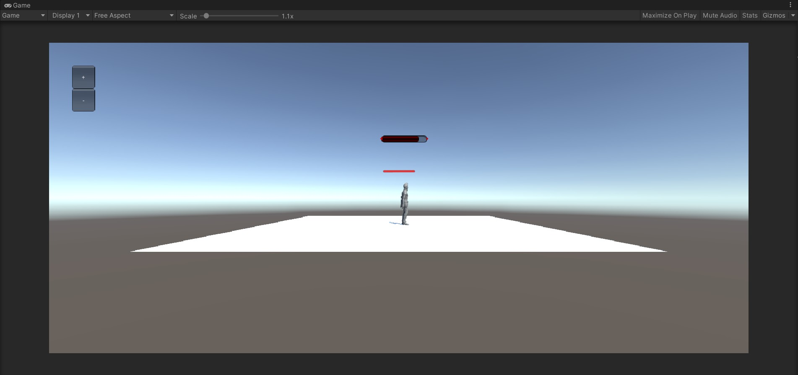
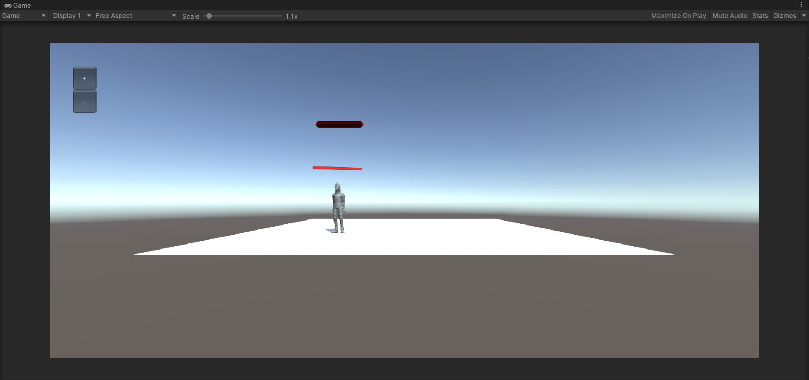

# 3D 游戏编程 ｜ UI 系统 作业

## 作业内容

血条（Health Bar）的预制设计。具体要求如下

* 分别使用 IMGUI 和 UGUI 实现
* 使用 UGUI，血条是游戏对象的一个子元素，任何时候需要面对主摄像机
* 分析两种实现的优缺点
* 给出预制的使用方法

### IMGUI 设计

IMGUI（Immediate Mode GUI）及时模式图形界面。它是代码驱动的 UI 系统，没有图形化设计界面，只能在 OnGUI 阶段用 GUI 系列的类绘制各种 UI 元素，因此 UI元素只能浮在游戏界面之上。

设计「血条」过程

* IMGUI 设计血条直接创建脚本即可。

* 利用 HorizontalScrollbar 显示血条，health 表示当前血量；transitionHealth 表示过渡血量，利用 Mathf.Lerp 实现血条缓慢编号。代码如下

  ```c#
  using System.Collections;
  using System.Collections.Generic;
  using UnityEngine;
  
  public class Lifebar : MonoBehaviour
  {
      float health;
      float transitionHealth;
  
      // Start is called before the first frame update
      void Start() {
          health = 100;
          transitionHealth = health;
      }
  
      void OnGUI() {
          if (GUI.Button(new Rect(50, 50, 50, 50), "+"))
          {
              transitionHealth += 10;
              if(transitionHealth > 100)
                  transitionHealth=100;
          }
          if (GUI.Button(new Rect(50, 100, 50, 50), "-"))
          {
              transitionHealth -= 10;
              if(transitionHealth < 0)
                  transitionHealth = 0;
          }
          Vector3 worldPos = new Vector3(transform.position.x, transform.position.y + 2.2f, transform.position.z );
          Vector2 screenPos = Camera.main.WorldToScreenPoint(worldPos);
          Rect rect = new Rect(screenPos.x - 50, Screen.height - screenPos.y + 50,100,200);
  
          GUI.color = Color.red;
          health = Mathf.Lerp(health, transitionHealth, 0.5f);
          GUI.HorizontalScrollbar(rect, 0, health, 0, 100);
      }
  
      // Update is called once per frame
      void Update()
      {
          
      }
  }
  ```

* 运行查看

  

### UGUI 设计

UGUI (Unity GUI) 是面向对象的 UI 系统。所有 UI 元素都是游戏对象，友好的图形化设计界面， 可在场景渲染阶段渲染这些 UI 元素。

设计「血条」过程

* 导入外部包 Assets -> Import Package -> Standard Assets

* 在项目中新建一个 Plane

* 在  Standard Assets/Charactors/ThirdPersonCharater/Prefab 中，选择 ThirdPersonController 并将其拖动到 Plane 上

* 调整 ThirdPersonController 的位置

  

* 右键 ThirdPersonController，选择 UI -> Canvas， 添加画布

* 右键 Canvas，选择 UI -> Slider，添加滑条当作血条

* 展开 Slider,  将 Handle Slider Area 和 Background 都 disable

  

* 展开 Slider,  设置 Fill Area -> Fill -> Image 选择红色

  

* 编写使血条朝向相机的 LookAtCamera 脚本

  ```c#
  using System.Collections;
  using System.Collections.Generic;
  using UnityEngine;
  
  public class LookAtCamera : MonoBehaviour
  {
      // Start is called before the first frame update
      void Start()
      {
          
      }
  
      // Update is called once per frame
      void Update()
      {
          this.transform.LookAt(Camera.main.transform.position);
      }
  }
  ```

* 修改之前的 Lifebar 脚本代码

  ```c#
  using System.Collections;
  using System.Collections.Generic;
  using UnityEngine;
  using UnityEngine.UI;
  
  public class Lifebar : MonoBehaviour
  {
      float health;
      float transitionHealth;
      public Slider healthSlider;
  
      // Start is called before the first frame update
      void Start() {
          health = 100;
          transitionHealth = health;
      }
  
      void OnGUI() {
          if (GUI.Button(new Rect(50, 50, 50, 50), "+"))
          {
              transitionHealth += 10;
              if(transitionHealth > 100)
                  transitionHealth=100;
          }
          if (GUI.Button(new Rect(50, 100, 50, 50), "-"))
          {
              transitionHealth -= 10;
              if(transitionHealth < 0)
                  transitionHealth = 0;
          }
          Vector3 worldPos = new Vector3(transform.position.x, transform.position.y + 2.2f, transform.position.z );
          Vector2 screenPos = Camera.main.WorldToScreenPoint(worldPos);
          Rect rect = new Rect(screenPos.x - 50, Screen.height - screenPos.y + 50,100,200);
  
          GUI.color = Color.red;
          health = Mathf.Lerp(health, transitionHealth, 0.5f);
          GUI.HorizontalScrollbar(rect, 0, health, 0, 100);
          healthSlider.value = health / 100;
      }
  
      // Update is called once per frame
      void Update()
      {
          
      }
  }
  ```

* 将脚本拖动到 Canvas 上，将 Slider 拖动到脚本上

  

* 运行查看效果

  

  

  

* 拖动 Canvas 到 Assets 中保存为预制

  

### 两种实现的优缺点

#### IMGUI

* 优点
  * 简单易用，上手难度比较低
  * IMGUI 的存在符合游戏编程的传统
  * 在修改模型，渲染模型这样的经典游戏循环编程模式中，在渲染阶段之后，绘制 UI 界面无可挑剔
  * 这样的编程既避免了 UI 元素保持在屏幕最前端，又有最佳的执行效率，一切控制掌握在程序员手中
* 缺点
  * 不支持可视化
  * 传统代码驱动的 UI 面临效率低下
  * 很难进行调试，因为没有用于玩家可能使用并与之交互的普通游戏内用户界面
  * 视觉效果一般，自定义程度低
  * 只能在 OnGUI 阶段绘制 UI ，因此 UI元素是浮在游戏界面上，和游戏内对象剥离的

#### UGUI

* 优点
  * UGUI 的样式、功能自定义程度高。因为它是一个GameObject，而不是纯代码驱动的。
  * 所见即所得 (WYSIWYG) 设计工具，设计师也能参与程序开发
  * 支持多模式、多摄像机渲染
  * UI 元素与游戏场景融为一体的交互
  * 面向对象的编程
* 缺点
  * 它的上手难度更高，需要熟悉 Unity 搞清楚画布是怎么运作的
  * 对于复杂的项目，可能需要创建很多的 Canvas，因此项目会变的更加复杂，不易操作
